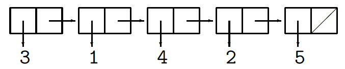
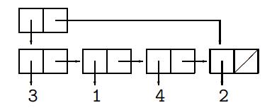
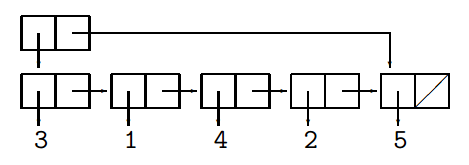

#Data Structures

##Array

2

Structured like so: [1,2,3,4,7,2...] with the nth element called as:
```
<array name>[n-1]
```

##Proof By Induction

* Base case- `C[0]`
* Inductive step- `C[i] => C[i+1]`
* In Sections 6.5 in PDF notes

1. Initialization ← takes in assumptions
2. Loop start
3. Repeated process ← presumes truth
4. Loop end ← truth of invariant + end condition

##Standard algorithm:

  * What does it do? : Specification
  * Does it really do what it's supposed to do? : Verification
  * How efficiently does it do it? : Performance analysis


##Linked Lists

3.1

A list of two celled blocks. One which contains data (e.g. 1, "apple", 'x') and
one which contains the location of the next container.



In order to create this we require:
1. `EmptyList`
2. `MakeList(element, list)`

For example to make [3,1,2] the constructors are assembled like so:
```java
MakeList(3, MakeList(1, MakeList(2, EmptyList)));
```

Note that this is an inductive way of building a data structure and this method
is going to be used multiple times.

We also need to be able to get elements back and since we no longer have just
item indexes we need to develop 2 methods to get the first element and also the
rest of the list.

* `first(list)`
* `rest(list)`

Also to check if a list is empty to avoid getting the rest of an empty list or
its first element.

* `isEmpty(list)`

We also may want to append or alter the list.

* `replaceFirst(x,l)`
* `replaceRest(r, l)`

All of these methods are either constructors, selectors and conditions and we
will be formatting our data representations and algorithms id terns of
appropriate definitions of them.

##XML

In general XML has become the go-to language for quasi-code in data structures.
For example below is a representation of a linked list.

```xml
<ol>
    <li>3</li>
    <li>4</li>
    <li>6</li>
    <li>1</li>
    <li>2</li>
</ol>
```

###Alternative code

```xml
<cell>
    <first>3</first>
    <rest>
        <cell>
            <first>1</first>
            <rest>
                <cell>
                    <first>4</first>
                    <rest>
                        <cell>
                            <first>2</first>
                            <rest>
                                <first>5</first>
                                <rest>EmptyList</rest>
                            </rest>
                        </cell>
                    </rest>
                </cell>
            </rest>
        </cell>
    </rest>
</cell>
```

##Recursion in linked lists

3.2

To find the last item in a linked list we first have to go through every other
cell before we can identify the last item as it will be attached to an empty
list.

Pseudocode:

```
last(l) {
    if (isEmpty(l)) {
        error("List is empty")
        } elseif(isEmpty(rest(l)){
        retuen first(l)
        } else{
        return last(rest(l))
    }
}
```

Note the time complexity of this is proportional to the length of the list as we
will always access each element before we arrive at the last element.

##Stacks

3.3

The majority of data structures can be narrowed down in to these collections

* Sets
* Stacks
* Sets

A linked list is equivalent to a linked list. They are the ideal data
structures to a 'First in Last Out' model.

[stack](images/stack.png)

###Constructors

Although they are almost identical to a linked list they require their own
_primitive operators_ are given different names and the stack [3,1,4,2,5] would
be represented with the 5 in the first tuple block (Note the previous image). The 2 constructors are:

* `EmptyStack` 
  * The empty stack
* `push(element, stack)`
  * Which layers an element in top of an already existing stack

###Selectors

* `top(stack)`
* `pop(stack)`

###Conditions

* `isEmpty(stack)`

##Queues

Very similar to a linked list graphically but with a pointer to the first and
last element in the list.


*Queue [3,1,4,2]*

This allows for efficiently taking the first or last element of the structure
independent of data length

###Constructors

* `EmptyQueue`
* `push(element, queue)`

For example if the take the above queue and apply `push(5, q)` we get:



###Conditions

* `isEmpty(queue)`

##Searching

4


